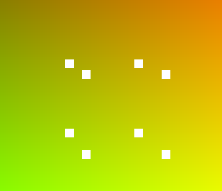

# Rust Vertex Projector

This is my try at creating a vertex projector. I did it in Rust because I am still trying to learn it.
The Renderer can take any number of vertices in 3d space and project them to a projection plane of a camera defined
by a position in 3d space and a rotation on the y-axis (up).

The renderer runs as WASM in the web, and you can try it [here](https://zenonet.de/interactive/rust3drenderer).

I tried to implement the projection algorithm by myself without looking up any maths.
In the end, I had to lookup how to rotate a vector though.

